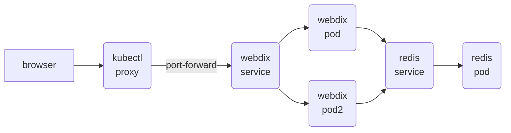

Kubernetes example with two applications
- A redis database
- An application that exposes redis through http



Deploy all files to Kubernetes

```
kubectl apply -f .
```

Run a redis SET and GET commands inside the webdix container

First get the pod for webdix

```
kubectl get pods

NAME                       READY   STATUS    RESTARTS   AGE
redis-855d674ddf-86bv4     1/1     Running   0          2m13s
webdix-684c6fd4d-2fg7x     1/1     Running   0          2m12s
```

And now execute wget inside the container

```
kubectl exec  webdix-684c6fd4d-2fg7x -- wget -O - -q localhost:7379/GET/name
{"SET":[true,"OK"]}

kubectl exec  webdix-684c6fd4d-2fg7x -- wget -O - -q localhost:7379/GET/name
{"GET":"john"}
```

You can also expose the service to the local environment

```
kubectl port-forward service/webdix 7379:7379
```

And access from the browser at http://localhost:7379/GET/name
