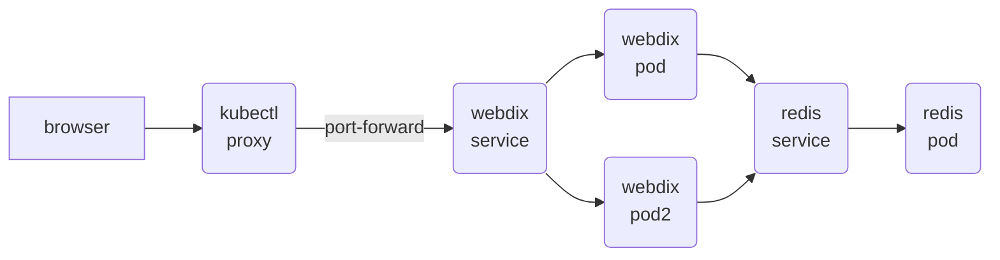

Kubernetes example with two applications
- A redis database
  - Deployed without permanent persistance
- An application that exposes redis through http
  - Simulates a real application, you can perform get/set operations to backend redis



Deploy all files to Kubernetes

```
kubectl apply -f .
```

And check the status of the deployments and pods

```
kubectl get deployments
NAME     READY   UP-TO-DATE   AVAILABLE   AGE
redis    1/1     1            1           13m
webdix   2/2     2            2           13m

kubectl get pods

NAME                      READY   STATUS    RESTARTS   AGE
redis-f6b66f4f7-t4lhp     1/1     Running   0          14m
webdix-64f94c6758-5nrcs   1/1     Running   0          14m
webdix-64f94c6758-mkgqf   1/1     Running   0          14m
```

Check that redis is working properly by opening a shell and using redis-cli

```
kubectl exec -ti redis-f6b66f4f7-t4lhp -- sh
# redis-cli
127.0.0.1:6379> set hello world
OK
127.0.0.1:6379> get hello
"world"
```

Now access the application, using executing a command inside one of the running containers.
(Since webdix container lacks `cURL` we will use `wget -O - ` for the requests)

And now execute wget inside the container

```
kubectl exec  webdix-684c6fd4d-2fg7x -- wget -O - -q localhost:7379/GET/name
{"SET":[true,"OK"]}

kubectl exec  webdix-684c6fd4d-2fg7x -- wget -O - -q localhost:7379/GET/name
{"GET":"john"}
```

You can also expose the service to the local environment

```
kubectl port-forward service/webdix 7379:7379
```

And access from the browser at http://localhost:7379/GET/name
